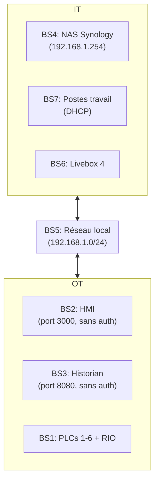

# Atelier 1 - Contexte et Objectifs de Sécurité
## Modèle alternatif - Cas SWaT

**Durée estimée** : 2-3 heures  
**Participants** : 3-5 personnes (analystes, métier, RSSI)

---

## Activité 1 : Définir le cadre de l'étude

### 1.1 Contexte de l'étude

| Élément | Description |
|---------|-------------|
| **Nom de l'étude** | Analyse de risques EBIOS RM - Usine SWaT |
| **Organisation** | Voelia |
| **Site** | Vergèze |
| **Périmètre** | Usine de traitement d'eau (10 000 habitants) |
| **Date** | Avril 2026 |

### 1.2 Objectifs de l'étude

| Objectif | Description | Priorité |
|----------|-------------|----------|
| O1 | Identifier les risques cybersécurité sur le système industriel | Critique |
| O2 | Évaluer les vulnérabilités IT/OT | Haute |
| O3 | Définir un plan de traitement | Haute |
| O4 | Sensibiliser les parties prenantes | Moyenne |

### 1.3 Référentiel applicable

| Référentiel | Application |
|------------|------------|
| EBIOS RM (ANSSI) | Méthode d'analyse de risques |
| ISO 27001 | Système de management SSI |
| Guide d'Hygiène Informatique | Bonnes pratiques |

### 1.4 RACI - Cadre de l'étude

| Tâche | Analyste | Métier | RSSI | Direction |
|--------|---------|-------|------|----------|
| Définition objectifs | R | C | A | A |
| Sélection référentiel | R | C | A | I |
| Validation cadre | A | I | C | R |

---

## Activité 2 : Définir le périmètre métier et technique

### 2.1 Périmètre métier

#### Entités métier

| Entité | Description | Limites |
|--------|-------------|---------|
| EM1 | Traitement de l'eau | P1 → P6 |
| EM2 | Distribution eau potable | Vers châteaux d'eau |
| EM3 | Gestion documentaire | NAS Synology |

#### Interactions externes

| Partie externe | Rôle | Type relation |
|--------------|------|-------------|
| SPE | Fournisseur eau brute | Contractuel |
| SDE | Distributeur eau | Contractuel |
| ITexpert | Maintenance IT | Prestataire |

### 2.2 Périmètre technique

#### Biens supports (IT/OT)

| ID | Bien support | Type | Localisation |
|----|-------------|------|--------------|
| BS1 | PLC1-PLC6 | Équipement | Site industriel |
| BS2 | HMI | Application | Port 3000 |
| BS3 | Historian | Application | Port 8080 |
| BS4 | NAS Synology | Serveur | 192.168.1.254 |
| BS5 | Réseau local | Infrastructure | 192.168.1.0/24 |
| BS6 | Passerelle Internet | Équipement | Livebox 4 |
| BS7 | Postes travail | Équipement | Bureau |

#### Architecture technique



### 2.3 RACI - Périmètre

| Tâche | Analyste | Métier | RSSI | ITexpert |
|--------|---------|-------|------|----------|
| Définition périmètre métier | R | A | C | I |
| Définition périmètre tech | C | I | R | C |
| Validation périmètre | A | C | R | I |

---

## Activité 3 : Identifier les événements redoutés

### 3.1 Biens essentiels / Valeurs métier

| ID | Bien essentiel | Nature | Criticité |
|----|----------------|--------|-----------|
| BE1 | Qualité de l'eau | Service | Critique |
| BE2 | Continuité distribution | Service | Critique |
| BE3 | Données industrielles | Information | Haute |
| BE4 | Réputation Voelia | Immatériel | Haute |
| BE5 | Équipements industriels | Matériel | Moyenne |

### 3.2 Biens supports associés

| Bien essentiel | Biens supports associés |
|----------------|------------------------|
| BE1 | BS1 (PLCs), BS2 (HMI), BS3 (Historian) |
| BE2 | BS1 (PLCs), BS5 (Réseau) |
| BE3 | BS3 (Historian), BS4 (NAS), BS5 (Réseau) |
| BE4 | BS3 (Historian), BS4 (NAS) |
| BE5 | BS1 (PLCs), BS2 (HMI) |

### 3.3 Événements redoutés

| ID | Événement redouté | Bien impacté | Gravité |
|----|-----------------|-------------|----------|
| ER1 | Contamination chimique de l'eau | BE1 | Critique |
| ER2 | Interruption distribution | BE2 | Critique |
| ER3 | Exfiltration données | BE3 | Haute |
| ER4 | Atteinte réputation | BE4 | Haute |
| ER5 | Destruction équipements | BE5 | Moyenne |
| ER6 | Compromission système | BE1, BE2, BE3 | Critique |

### 3.4 Grille d'analyse

| Événement redouté | Disponibilité | Intégrité | Confidentialité |
|----------------|-------------|----------|---------------|
| ER1 | - | Critique | - |
| ER2 | Critique | - | - |
| ER3 | - | Haute | Haute |
| ER4 | - | Haute | - |
| ER5 | Moyenne | Haute | - |
| ER6 | Critique | Critique | Haute |

### 3.5 RACI - Événements redoutés

| Tâche | Analyste | Métier | RSSI | Direction |
|--------|---------|-------|------|------------|
| Identification BE | R | A | C | I |
| Cartographie BS | R | C | A | I |
| Définition ER | R | A | C | I |
| Validation grille | C | I | R | A |

---

## Activité 4 : Déterminer le socle de sécurité

### 4.1 Exigences de sécurité

#### Exigences héritées

| Bien essentiel | Exigence D | Exigence I | Exigence C |
|----------------|-----------|----------|-------------|
| BE1 | Critique | Critique | - |
| BE2 | Critique | Haute | - |
| BE3 | Haute | Haute | Moyenne |
| BE4 | - | Haute | Moyenne |
| BE5 | Haute | Haute | - |

#### Exigences complémentaires

| ID | Exigence | Catégorie | Priorité |
|----|----------|-----------|----------|
| E1 | Contrôle accès physique | organisation | Haute |
| E2 | Segmentation IT/OT | Technique | Critique |
| E3 | Authentification HMI/Historian | Technique | Critique |
| E4 | Politique mots de passe | Organisation | Haute |
| E5 | Supervision/monitoring | Technique | Haute |

### 4.2 Contraintes et hypothèses

#### Contraintes

| Contrainte | Description | Impact |
|------------|-------------|---------|
| C1 | Budget limité | Réduction mesures |
| C2 | Équipements existants | Pas de renouvellement |
| C3 | Intervention ITexpert externe | Risque tiers |

#### Hypothèses

| Hypothèse | Description |
|-----------|-------------|
| H1 | Réseau isolé initialement |
| H2 | Accès physique restreint aux employés |
| H3 | Pas de connexion OT vers l'extérieur |

### 4.3 Niveau de sécurité cible

| Niveau | Description | Justification |
|--------|-------------|---------------|
| NS3 | Résistant | Infrastructure critique (eau potable) |

### 4.4 RACI - Socle de sécurité

| Tâche | Analyste | Métier | RSSI | Direction |
|--------|---------|-------|------|----------|
| Définition exigences | R | C | A | I |
| Identification contraintes| R | A | C | I |
| Niveau cible | C | I | R | A |
| Validation socle | I | C | A | R |

---

## Synthèse - Atelier 1 (Modèle alternatif)

### Matrice RACI complète

| Activité | Tâche | Analyste | Métier | RSSI | Direction | ITexpert |
|----------|-------|---------|-------|------|-----------|----------|
| 1 | Cadre étude | R | C | A | A | I |
| 2 | Périmètre métier | R | A | C | I | I |
| 2 | Périmètre tech | C | I | R | I | C |
| 3 | Biens essentiels| R | A | C | I | I |
| 3 | Événements ER | R | A | C | I | I |
| 4 | Exigences | R | C | A | I | I |
| 4 | Socle sécurité| C | I | R | A | I |

### Biens essentiels et supports

```
BE1 (Qualité eau) ─────┬──→ BS1 (PLCs)
                       ├──→ BS2 (HMI)
                       └──→ BS3 (Historian)

BE2 (Continuité) ──────┼──→ BS1 (PLCs)
                       └──→ BS5 (Réseau)

BE3 (Données) ─────────┼──→ BS3 (Historian)
                       ├──→ BS4 (NAS)
                       └──→ BS5 (Réseau)

BE4 (Réputation) ──────┼──→ BS3 (Historian)
                       └──→ BS4 (NAS)

BE5 (Équipements) ────┴──→ BS1 (PLCs)
```

### Livrables

| Livrable | Document |
|----------|-----------|
| L1 | Périmètre défini et validé |
| L2 | 5 biens essentiels identifiés |
| L3 | 6 événements redoutés cartographiés |
| L4 | Socle de sécurité défini |
| L5 | Matrice RACI complétée |

### Critères de passage

- [ ] Périmètre validé par les parties prenantes
- [ ] Biens essentiels-alignés avec les événements redoutés
- [ ] Socle de sécurité cohérent avec les exigences
- [ ] Matrice RACI complète et accepted